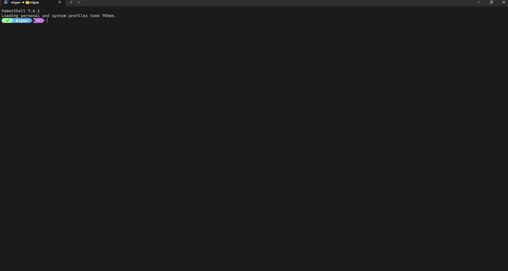

[English](README.md) | **Español**

# dotfiles-windows

Setup de Windows 11 para desarrollo: PowerShell, oh-my-posh, Windows Terminal,
VS Code, WSL y el toolchain de desarrollo, con instalación en un comando.

[](https://github.com/M1gu3l4ngel/dotfiles-windows/actions/workflows/ci.yml)



## Reproducir en un comando

En una PC nueva (pedirá UAC para WSL, Docker y algunas apps). Desde PowerShell:

```powershell
git clone https://github.com/M1gu3l4ngel/dotfiles-windows.git $env:USERPROFILE\dotfiles
cd $env:USERPROFILE\dotfiles
.\bootstrap.ps1
```

Para ver qué haría sin cambiar nada: `.\bootstrap.ps1 -DryRun`.

Después, completa los pasos manuales (claves GPG/SSH) que el propio script lista.

## Requisitos previos

- Windows 10/11 con `winget` (App Installer, de la Microsoft Store).
- **git** para clonar el repo. Si la PC no lo trae (recién formateada), instálalo
  primero y reabre la terminal: `winget install Git.Git`. El `bootstrap.ps1`
  instala y actualiza todo lo demás de forma idempotente (git incluido: si ya
  está, lo salta).
- **Developer Mode** activado (Settings → Privacy & security → For developers) o
  ejecutar PowerShell como administrador: necesario para crear los symlinks.
- Recomendado: ejecutar `bootstrap.ps1` como administrador (WSL y Docker lo piden).

## Qué hace bootstrap.ps1

Es idempotente: cada paso comprueba si ya está hecho, así que se puede re-ejecutar
sin romper nada (por ejemplo tras un reinicio).

| Paso | Qué instala o configura |
|---|---|
| 1 | Set esencial de winget: Git, PowerShell 7, Windows Terminal, VS Code, oh-my-posh, Gpg4win, Rust, Python, Docker, WSL y CLI tools (fzf, ripgrep, bat, fd, jq, lsd, Neovim) |
| 2 | CaskaydiaCove Nerd Font (descarga verificada por SHA-256) |
| 3 | Variables de entorno hacia `D:` (o `C:` si no hay `D:`) |
| 4 | Node (nvm-windows) + pnpm + Claude Code en `<disk>\Dev\npm-global` |
| 5 | WSL Ubuntu (requiere reinicio) |
| 6 | git: nombre, email noreply y defaults |
| 7 | Symlinks de configuración (`install.ps1`) |
| 8 | Muestra los pasos manuales que implican secretos (GPG/SSH) |

Solo instala el **entorno**. Las apps personales no se tocan (ver `apps/`).

## Instalar solo las configuraciones

Si ya tienes el stack instalado y solo quieres estas configs:

```powershell
.\install.ps1
```

Antes de crear cada enlace, `install.ps1` renombra tu archivo existente con el
sufijo `.pre-dotfiles.bak`. Para volver atrás, usa `uninstall.ps1` (abajo).

## Desinstalar

Revierte los symlinks y restaura tus archivos originales (los `.pre-dotfiles.bak`).
Con `-DryRun` solo muestra qué haría, sin tocar nada; sin él, revierte de verdad:

```powershell
.\uninstall.ps1 -DryRun
.\uninstall.ps1
```

No desinstala apps ni toca variables de entorno o WSL.

## Pasos manuales (implican secretos, no se automatizan)

1. Claves SSH y GPG, y firma de commits: [docs/gpg-signing.es.md](docs/gpg-signing.es.md).
2. Restaurar las extensiones de VS Code:

   ```powershell
   Get-Content .\vscode\extensions.txt | ForEach-Object { code --install-extension $_ }
   ```

## Estructura

| Ruta | Contenido |
|---|---|
| `bootstrap.ps1` | Instalación del entorno en un comando |
| `install.ps1` | Symlinks de configuración |
| `uninstall.ps1` | Revertir los symlinks y restaurar los backups (`-DryRun` para simular) |
| `lib/` | Código compartido (el mapeo de symlinks) |
| `powershell/` | Perfil de PowerShell (PS 7 y legacy, mismo archivo) |
| `bash/` | Perfil de Git Bash (mismo prompt que PowerShell) |
| `oh-my-posh/` | Tema del prompt (`capr4n`, compartido con Parrot) |
| `windows-terminal/` | Settings de Windows Terminal |
| `vscode/` | Settings, keybindings y lista de extensiones |
| `apps/` | Snapshot de referencia de aplicaciones |
| `docs/` | Guías detalladas |
| `.claude/rules/` | Convenciones del proyecto (las carga Claude Code) |

## Reproducibilidad entre máquinas

El repo detecta el disco de trabajo (`D:` o `C:`) y no depende de rutas fijas de
usuario, así que clonarlo y correr `bootstrap.ps1` deja otra PC con el mismo
entorno. Las apps personales y los secretos se restauran aparte (imagen del
sistema y claves nuevas).

## Snapshot de aplicaciones

`apps/winget-dev.json` lista las apps de entorno/desarrollo, reinstalables con
`winget import`. Las apps personales no se versionan: se restauran con la imagen
del sistema. Detalle en [apps/README.es.md](apps/README.es.md).

## Nombre visual del prompt (opcional)

Por defecto el prompt muestra tu usuario de Windows. Si prefieres mostrar otro
nombre (solo en pantalla, sin tocar el sistema), usa el ayudante:

```powershell
.\tools\set-prompt-name.ps1
```

Te pregunta el nombre (Enter en blanco = tu usuario real) y lo guarda en la
variable `POSH_NAME`, que el tema lee. Es puramente decorativo: no afecta rutas,
comandos ni git.

## Solución de problemas

| Síntoma | Causa | Solución |
|---|---|---|
| `install.ps1` falla al crear symlinks | Developer Mode apagado | Activarlo, o ejecutar como administrador |
| El prompt no aparece en una terminal nueva | El perfil no se cargó | `. $PROFILE`, o reabrir la terminal |
| Iconos como cuadrados | Falta CaskaydiaCove Nerd Font | Re-ejecutar `bootstrap.ps1` |
| `nvm` no reconocido tras el bootstrap | PATH no refrescado | Reabrir PowerShell y volver a correr `bootstrap.ps1` |
| GitHub muestra "Unverified" | El UID de la clave GPG no tiene el email noreply | [docs/gpg-signing.es.md](docs/gpg-signing.es.md) |

## Documentación y contribución

Guías en [docs/](docs/README.es.md). Convenciones en `.claude/rules/`. Para
contribuir o modificar el repo: [CONTRIBUTING.es.md](CONTRIBUTING.es.md).

## Créditos y licencia

El prompt de oh-my-posh y la paleta de colores se comparten con
[dotfiles-parrot](https://github.com/M1gu3l4ngel/dotfiles-parrot).

Licencia [MIT](LICENSE).
