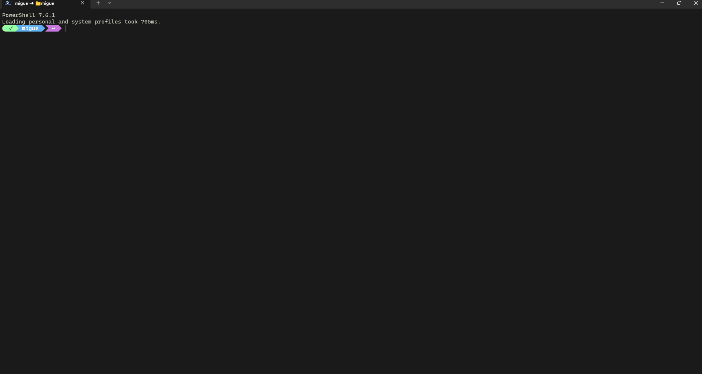

# 🪟 dotfiles-windows

Configuración personal de Windows 11 con PowerShell + oh-my-posh + Windows Terminal + VS Code + WSL Ubuntu.
Pensado para desarrollo profesional, productividad y replicabilidad entre máquinas — clona este repo en otra PC y en pocos minutos tienes exactamente el mismo setup.



---

## ✨ Stack

| Componente | Para qué sirve |
|---|---|
| **PowerShell 7+** (`pwsh`) | Shell moderna |
| **Windows PowerShell** (`powershell`) | Shell legacy (también queda configurada) |
| **WSL Ubuntu / bash** | Subsistema Linux con el mismo prompt |
| **oh-my-posh** | Prompt personalizable con temas, multiplataforma |
| **Terminal-Icons** | Iconos por tipo de archivo en `ls` / `dir` |
| **Windows Terminal** | Emulador de terminal |
| **VS Code** | Editor con settings, keybindings y lista de extensiones |
| **Hack Nerd Font** | Fuente con iconos para oh-my-posh |

> **Símbolo del sistema (CMD)** queda fuera intencionalmente — no soporta prompts modernos nativamente y requeriría instalar [Clink](https://chrisant996.github.io/clink/) para hacerlo funcionar, lo cual no aporta valor sobre PowerShell 7.

---

## 🔄 Migración rápida (si ya tienes el stack instalado)

¿Tu PC ya tiene PowerShell 7, Windows Terminal, VS Code, oh-my-posh y los demás componentes funcionando, y solo quieres aplicar **mis configs** encima de las tuyas?

**Salta los Pre-requisitos y arranca directo en el [Paso 1](#-paso-1--clonar-el-repo)**. El `install.ps1` es seguro para este caso porque:

- Detecta cada archivo de config existente (PowerShell profile, settings de Windows Terminal, settings de VS Code, etc.)
- Le hace **backup automático** con sufijo `.pre-dotfiles.bak` antes de tocarlo
- Crea un symlink hacia el archivo del repo

Si después algo no te gusta, revertir es renombrar el `.pre-dotfiles.bak` de vuelta a su nombre original. No reinstala ni toca tus herramientas, solo cambia los archivos de configuración.

---

## 📋 Pre-requisitos

Antes de aplicar los dotfiles necesitas tener el stack instalado. **Si ya lo tienes** (caso de migración arriba), salta esta sección.

### 1. Activar Developer Mode

Necesario para crear symlinks sin Administrador.

`Settings` → `Privacy & security` → `For developers` → activar **Developer Mode**

### 2. Habilitar ejecución de scripts en Windows PowerShell

Solo necesario si vas a usar **Windows PowerShell** (legacy). Sin esto, el profile no carga. Desde Windows PowerShell (no PowerShell 7):

```powershell
Set-ExecutionPolicy -ExecutionPolicy RemoteSigned -Scope CurrentUser
```

Confirma con `S` cuando pregunte. `RemoteSigned` permite scripts locales y bloquea los descargados sin firmar.

### 3. Instalar herramientas con winget

```powershell
winget install Microsoft.PowerShell
winget install Microsoft.WindowsTerminal
winget install Microsoft.VisualStudioCode
winget install JanDeDobbeleer.OhMyPosh -s winget
winget install Git.Git
```

### 4. Instalar Hack Nerd Font

Descarga desde [nerdfonts.com](https://www.nerdfonts.com/) → opción "Hack" → extrae el zip → click derecho en cada `.ttf` → **Install**.

### 5. Instalar módulo Terminal-Icons (en ambos shells si vas a usar los dos)

Importante: **PowerShell 7 y Windows PowerShell legacy tienen carpetas de módulos separadas**. Si vas a usar ambos shells, instala Terminal-Icons en cada uno por separado.

Desde **PowerShell 7** (`pwsh`):

```powershell
Install-Module -Name Terminal-Icons -Repository PSGallery -Scope CurrentUser
```

Desde **Windows PowerShell** (`powershell`, opcional si solo usas PS7):

```powershell
Install-Module -Name Terminal-Icons -Repository PSGallery -Scope CurrentUser
```

Cuando pregunte si confías en `PSGallery` → `S` (Sí).

---

## 🚀 Paso 1 — Clonar el repo

```powershell
git clone https://github.com/M1gu3l4ngel/dotfiles-windows.git $env:USERPROFILE\dotfiles
cd $env:USERPROFILE\dotfiles
```

> El repo en GitHub se llama `dotfiles-windows` (para distinguir del repo de Parrot), pero localmente lo clonamos como `dotfiles` para mantener la convención de carpetas corta.

---

## 🚀 Paso 2 — Ejecutar el instalador

```powershell
.\install.ps1
```

El script:
- Crea backup de tus configs actuales (`<archivo>.pre-dotfiles.bak`)
- Crea symlinks desde las ubicaciones estándar hacia los archivos del repo
- Cubre PowerShell 7, Windows PowerShell legacy, oh-my-posh theme, Windows Terminal y VS Code
- Es idempotente: si lo corres dos veces, no rompe nada

---

## 🚀 Paso 3 — Configurar git

```powershell
git config --global user.name "Tu Nombre"
git config --global user.email "tu@email.com"
git config --global init.defaultBranch main
git config --global http.postBuffer 524288000
```

> `.gitconfig` no se versiona en este repo porque acumula entradas `safe.directory` por máquina (rutas locales). Se configura una vez con estos comandos y git se encarga del resto.

---

## 🚀 Paso 4 — Restaurar extensiones de VS Code

```powershell
Get-Content .\vscode\extensions.txt | ForEach-Object { code --install-extension $_ }
```

Esto instala las extensiones del listado guardado.

---

## 🚀 Paso 5 — WSL Ubuntu (opcional)

Si usas WSL Ubuntu, puedes darle **el mismo prompt** que tu PowerShell, leyendo el archivo de tema directamente desde `/mnt/c/` (cero duplicación — si editas el tema en Windows, también cambia en WSL).

### 5.1 — Instalar unzip (prerequisito de oh-my-posh)

```bash
sudo apt update && sudo apt install -y unzip
```

### 5.2 — Instalar oh-my-posh en WSL

```bash
curl -s https://ohmyposh.dev/install.sh | bash -s
```

### 5.3 — Agregar oh-my-posh al `.bashrc`

Edita `~/.bashrc` con `nano ~/.bashrc` y agrega al final:

```bash
# oh-my-posh — mismo tema que Windows (via dotfiles en /mnt/c)
export PATH="$HOME/.local/bin:$PATH"
eval "$(oh-my-posh init bash --config /mnt/c/Users/<TU_USUARIO>/dotfiles/oh-my-posh/capr4n.omp.json)"
```

Reemplaza `<TU_USUARIO>` por tu nombre de usuario de Windows (en mi caso, `migue`).

### 5.4 — Recargar

```bash
source ~/.bashrc
```

Deberías ver el prompt **idéntico** al de PowerShell.

---

## 📂 Estructura

```
dotfiles/
├── powershell\                   → ~\Documents\PowerShell\ (PS 7)
│                                 → ~\Documents\WindowsPowerShell\ (PS legacy)
├── oh-my-posh\                   → ~\AppData\Local\Programs\oh-my-posh\themes\
├── windows-terminal\             → ~\AppData\Local\Packages\Microsoft.WindowsTerminal_*\LocalState\
├── vscode\                       → ~\AppData\Roaming\Code\User\
├── install.ps1
├── README.md
├── LICENSE
├── CLAUDE.md
└── .gitignore
```

El mismo `Microsoft.PowerShell_profile.ps1` se usa para PowerShell 7 y Windows PowerShell legacy (ambos symlinks apuntan al mismo archivo del repo).

---

## 🛠 Personalizar

Edita los archivos en `~\dotfiles\` — los symlinks hacen que los cambios se apliquen al reabrir la app correspondiente. Para el PowerShell profile basta con `. $PROFILE` en una sesión activa.

---

## 🔄 Regenerar lista de extensiones de VS Code

Cuando instales una nueva extensión y quieras versionarla:

```powershell
code --list-extensions | Out-File -FilePath .\vscode\extensions.txt -Encoding utf8
```

---

## 🙏 Créditos

Inspirado en [oh-my-posh](https://ohmyposh.dev/) de **Jan De Dobbeleer**, en el módulo [Terminal-Icons](https://github.com/devblackops/Terminal-Icons), y en mi setup paralelo de Parrot Security en [dotfiles-parrot](https://github.com/M1gu3l4ngel/dotfiles-parrot).

Adaptado por **M1gu3l4ng3l** para flujo profesional en Windows.

---

## 📜 Licencia

[MIT](LICENSE) — usa, copia, modifica libremente.

---

Hecho con 🪟 por **[M1gu3l4ng3l](https://github.com/M1gu3l4ngel)**
